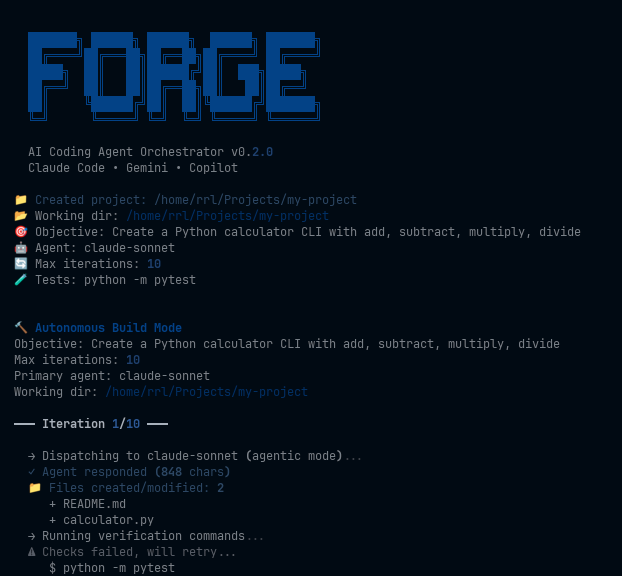

# Forge



**Multi-agent AI coding orchestrator.** Forge unifies Claude Code, Gemini CLI, and GitHub Copilot into a single command-line interface with inter-agent communication, autonomous builds, and structured result aggregation.

---

## Table of Contents

- [Overview](#overview)
- [Installation](#installation)
- [Quick Start](#quick-start)
- [Orchestration Modes](#orchestration-modes)
- [Autonomous Build](#autonomous-build)
- [Configuration](#configuration)
- [Architecture](#architecture)
- [Cost Model](#cost-model)
- [Contributing](#contributing)
- [License](#license)

## Overview

Forge dispatches coding tasks to multiple AI agents, compares their outputs, and selects the best result. It supports advanced orchestration patterns where agents collaborate -- one drafts, another reviews, a third refines. For autonomous builds, Forge iteratively generates code, installs dependencies, runs tests, and feeds errors back to agents until the project compiles and passes.

### Key Capabilities

- **Multi-model dispatch** -- Run the same prompt across Claude Sonnet, Opus, Haiku, Gemini, and Copilot simultaneously.
- **Inter-agent communication** -- Chain, review, consensus, and swarm orchestration modes where agents build on each other's output.
- **Autonomous build pipeline** -- Agentic code generation with workspace-aware context, iterative verification, error classification, and automatic rollback.
- **Session memory** -- Agents remember previous attempts and avoid repeating failed approaches.
- **Smart testing** -- Auto-detects project type and generates appropriate verification commands.
- **Structured output** -- Per-agent cost tracking, token counts, duration, and model identification.
- **Project scaffolding** -- Create new projects with `forge build --new <name>` and built-in templates via `forge init`.

## Installation

Requires Python 3.11 or later.

```bash
git clone https://github.com/Artaeon/forge-ai.git
cd forge-ai
python3 -m venv .venv
source .venv/bin/activate
pip install -e .
```

### Prerequisites

At least one of the following AI CLIs or API keys must be configured:

| Agent | Install / Setup | Documentation |
|-------|----------------|---------------|
| Claude Code | `npm install -g @anthropic-ai/claude-code` | [claude.ai/code](https://claude.ai/code) |
| Antigravity | `pip install google-genai` + set `GOOGLE_API_KEY` | [ai.google.dev](https://ai.google.dev/) |
| Gemini CLI | `npm install -g @google/gemini-cli` | [github.com/google/gemini-cli](https://github.com/google/gemini-cli) |
| GitHub Copilot | `gh extension install github/gh-copilot` | [docs.github.com/copilot](https://docs.github.com/en/copilot) |

Verify available agents:

```bash
forge config
```

## Quick Start

### Single Agent Dispatch

```bash
forge run "Write a Python fibonacci function"
forge run -a claude-opus "Design a database schema for a blog"
forge run -a antigravity-pro "Implement a binary search tree"
forge run -a antigravity-flash "Explain what asyncio does in three sentences"
```

### Multi-Agent Comparison

```bash
forge run --all "Implement a binary search" --best
```

### Autonomous Build

```bash
forge build --new my-api "Create a FastAPI REST API with authentication and tests"
```

## Orchestration Modes

Forge supports six orchestration patterns that control how agents interact during task execution.

| Mode | Description | Min. Agents |
|------|-------------|-------------|
| `single` | One agent, one shot. | 1 |
| `parallel` | All agents produce independently; best result is auto-selected. | 2 |
| `chain` | Sequential pipeline where each agent improves the previous output. | 2 |
| `review` | Three-round cycle: produce, critique, refine. | 2 |
| `consensus` | All agents produce independently, then a judge synthesizes the best parts. | 2 |
| `swarm` | A planner decomposes the task into subtasks assigned to best-fit agents. | 2 |

### Examples

```bash
# Chain: fast agent drafts, strong agent polishes
forge run --mode chain -a claude-haiku -a claude-sonnet "Implement a linked list"

# Review: produce, critique, refine
forge run --mode review -a claude-sonnet -a claude-opus "Write a secure auth module"

# Consensus: all agents produce, judge picks best parts
forge run --all --mode consensus "Write a caching layer"

# Swarm: planner assigns subtasks to best agents
forge run --all --mode swarm "Build a full CRUD application"
```

## Autonomous Build

The build pipeline operates in agentic mode, where the AI agent creates and modifies files directly on disk. It iterates until all verification commands pass.

```bash
# Create a new project from scratch
forge build --new my-api "Create a FastAPI REST API with authentication"

# Build in the current directory with custom test command
forge build "Add unit tests for all modules" --test-cmd "python -m pytest"

# Auto-commit successful iterations
forge build "Refactor to TypeScript" --auto-commit

# Initialize from a template, then build
forge init flask-api --dir ./my-app
forge build --dir ./my-app "Add user registration with email verification"
```

### Build Pipeline

Each iteration follows this sequence:

1. **Context gathering** -- Scans the workspace for file tree, git status, and framework detection.
2. **Agent dispatch** -- Sends the objective with full workspace context to the agent in agentic mode (file write access).
3. **File tracking** -- Detects created and modified files.
4. **Dependency installation** -- Auto-installs from `requirements.txt`, `package.json`, or equivalent.
5. **Verification** -- Runs test and lint commands. Auto-detects appropriate commands if none specified.
6. **Error classification** -- Categorizes failures (syntax, dependency, logic, architecture) and routes accordingly.
7. **Rollback protection** -- If a new iteration regresses, automatically rolls back to the last known good state.
8. **Retry or escalate** -- Feeds errors back to the agent. Escalates to a stronger model after repeated failures.

### Multi-Agent Builds

The build pipeline supports role-based agent assignment:

- **Planner** (Haiku) -- Breaks the objective into implementation steps.
- **Coder** (Sonnet) -- Implements each step.
- **Reviewer** (Opus) -- Reviews code before verification.

Automatic escalation: if the coder fails three consecutive iterations, Forge escalates to a stronger model.

## Configuration

Forge reads configuration from `forge.yaml`, searching upward from the working directory. Fallback location: `~/.config/forge/forge.yaml`.

```yaml
global:
  timeout: 120
  max_parallel: 5
  auto_commit: false
  max_build_iterations: 10

agents:
  claude-sonnet:
    enabled: true
    agent_type: claude
    command: claude
    model: sonnet
    max_budget_usd: 1.0

  claude-opus:
    enabled: true
    agent_type: claude
    command: claude
    model: opus
    max_budget_usd: 5.0

  claude-haiku:
    enabled: true
    agent_type: claude
    command: claude
    model: haiku
    max_budget_usd: 0.25

  gemini:
    enabled: true
    agent_type: gemini
    command: gemini

  copilot:
    enabled: true
    agent_type: copilot
    command: gh

workspace:
  default_dir: "."
  create_git: true
  projects_root: "~/Projects"

build:
  test_commands:
    - "python -m pytest"
  lint_commands:
    - "python -m ruff check ."
```

### Agent Configuration Reference

| Field | Type | Default | Description |
|-------|------|---------|-------------|
| `enabled` | bool | `true` | Whether the agent is active. |
| `agent_type` | string | -- | Backend type: `claude`, `gemini`, or `copilot`. |
| `command` | string | -- | CLI binary name. |
| `model` | string | -- | Model variant (e.g., `sonnet`, `opus`, `haiku`). |
| `max_budget_usd` | float | -- | Per-request cost cap in USD. |
| `skip_permissions` | bool | `false` | Skip file write permission prompts. |
| `extra_args` | list | `[]` | Additional CLI arguments passed to the agent. |

## Architecture

```
forge/
  cli.py                CLI entry point (Click)
  config.py             Configuration loading and validation (Pydantic)
  engine.py             Agent lifecycle and parallel dispatch (asyncio)
  aggregator.py         Result scoring and comparison
  orchestrate.py        Inter-agent communication patterns
  agents/
    base.py             Agent protocol and data models
    claude.py           Claude Code adapter (print + agentic modes)
    antigravity.py      Antigravity adapter (Google GenAI SDK)
    gemini.py           Gemini CLI adapter
    copilot.py          GitHub Copilot adapter
  build/
    pipeline.py         Autonomous build loop with verification
    context.py          Workspace-aware context gathering
    memory.py           Session memory across iterations
    testing.py          Smart test generation and detection
    errors.py           Error classification and routing
    templates.py        Project templates for scaffolding
    workspace.py        File tree and git state management
  tui/
    panels.py           Terminal UI components (Rich)
```

The engine initializes agent adapters from configuration, supporting multiple model variants per backend. The orchestrator implements communication patterns on top of the engine's dispatch primitives. The build pipeline uses the Claude adapter's agentic mode for file system access, with workspace context, session memory, and error classification driving iteration strategy.

## Cost Model

Forge tracks per-agent costs as reported by the underlying CLIs. Claude Code costs are deducted from your Anthropic subscription (Pro or Max plan) and are not billed separately via API. The `max_budget_usd` configuration acts as a safety cap per individual request.

## Contributing

Contributions are welcome. Please open an issue to discuss proposed changes before submitting a pull request.

1. Fork the repository.
2. Create a feature branch: `git checkout -b feature/your-feature`
3. Commit your changes with descriptive messages.
4. Open a pull request against `main`.

## License

This project is licensed under the MIT License. See [LICENSE](LICENSE) for details.

## Author

Artaeon -- [raphael.lugmayr@stoicera.com](mailto:raphael.lugmayr@stoicera.com)
