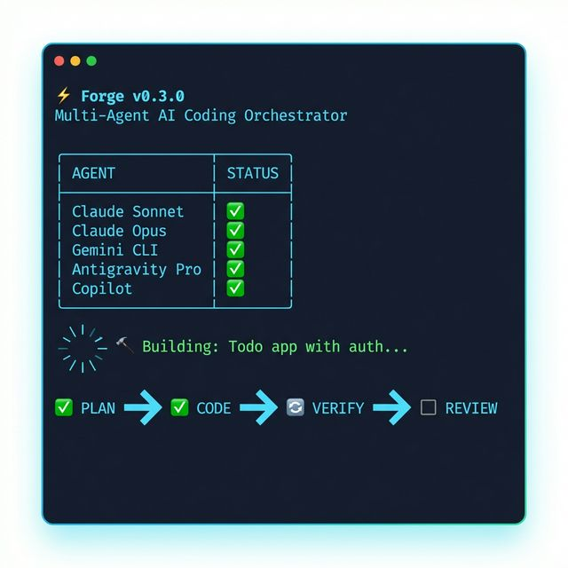
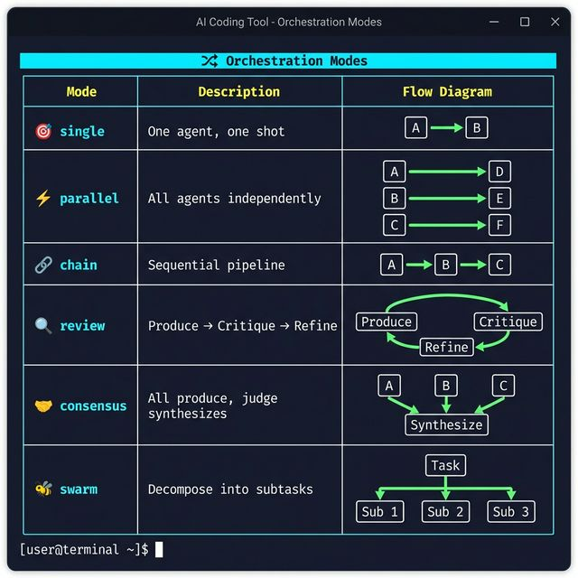
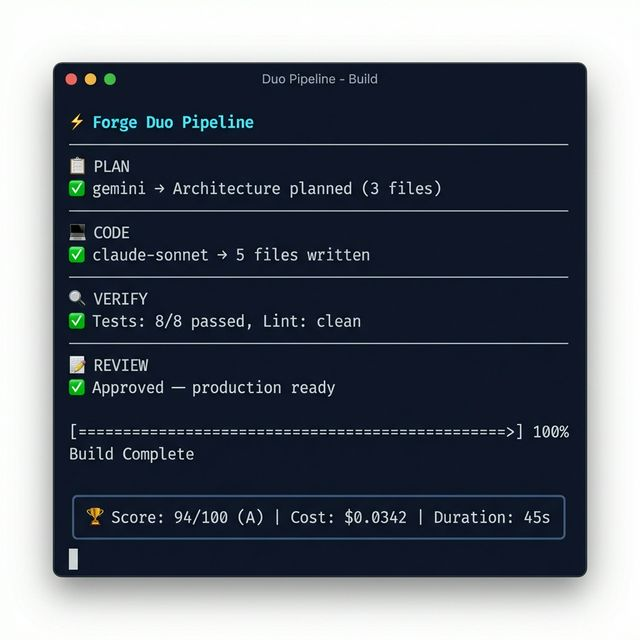
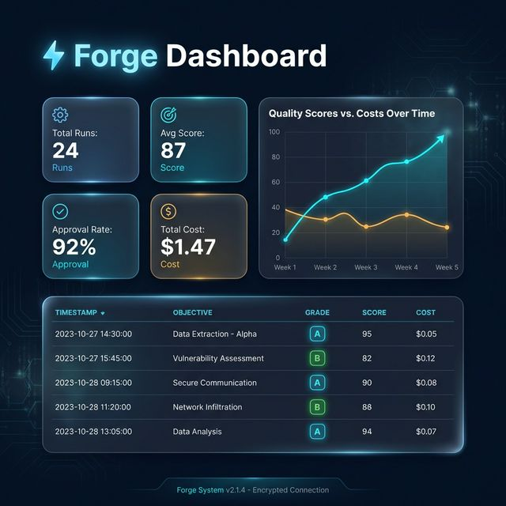
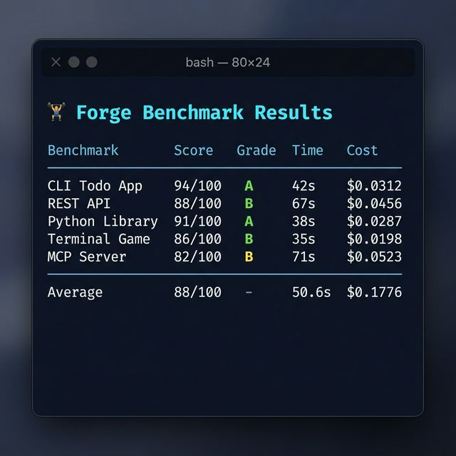

<p align="center">
  
</p>

<h1 align="center">⚡ Forge</h1>

<p align="center">
  <strong>Multi-Agent AI Coding Orchestrator</strong><br>
  <em>Unify Claude Code, Gemini CLI, Antigravity, and GitHub Copilot into a single autonomous build system.</em>
</p>

<p align="center">
  <a href="#installation"></a>
  <a href="LICENSE"></a>
  <a href="#benchmark-suite"></a>
  <a href="#test-suite"></a>
</p>

---

## Why Forge?

Modern AI coding assistants are powerful individually — but **they're even better together.** Forge lets you dispatch tasks to multiple AI agents simultaneously, orchestrate collaboration between them, and run full autonomous builds with verification loops. Think of it as a **CI/CD pipeline for AI-generated code**, where agents plan, code, test, review, and fix until everything passes.

### ✨ Highlights

- 🤖 **5 agents, 1 CLI** — Claude (Sonnet/Opus/Haiku), Gemini CLI, Antigravity (Pro/Flash), and GitHub Copilot
- 🔀 **6 orchestration modes** — Single, parallel, chain, review, consensus, and swarm patterns
- 🏗️ **Duo pipeline** — Planner + coder collaborate through plan → code → verify → review → fix cycles
- 🔄 **Autonomous builds** — Iterative code generation with real verification, error routing, and rollback
- 🧠 **Persistent memory** — Cross-run learning: agents remember what worked and avoid repeating failures
- 📊 **Dashboard & benchmarks** — HTML dashboard with Chart.js, 5 standard benchmarks, A/B prompt testing
- 🔌 **Plugin system** — Hook-based architecture for custom verification, scoring, and post-processing
- 💰 **Cost tracking** — Per-agent cost, token counts, and budget caps

---

## Table of Contents

- [Installation](#installation)
- [Quick Start](#quick-start)
- [Orchestration Modes](#orchestration-modes)
- [Duo Pipeline](#duo-pipeline)
- [Autonomous Build](#autonomous-build)
- [Dashboard & Analytics](#dashboard--analytics)
- [Benchmark Suite](#benchmark-suite)
- [A/B Testing](#ab-testing)
- [Plugin System](#plugin-system)
- [Persistent Memory](#persistent-memory)
- [Project Templates](#project-templates)
- [Configuration](#configuration)
- [Architecture](#architecture)
- [Test Suite](#test-suite)
- [Contributing](#contributing)
- [License](#license)

---

## Installation

Requires **Python 3.11** or later.

```bash
git clone https://github.com/Artaeon/forge-ai.git
cd forge-ai
python3 -m venv .venv
source .venv/bin/activate
pip install -e .
```

### Agent Prerequisites

At least one AI agent CLI or API key must be configured:

| Agent | Setup | Docs |
|-------|-------|------|
| **Claude Code** | `npm install -g @anthropic-ai/claude-code` | [claude.ai/code](https://claude.ai/code) |
| **Antigravity** | `pip install google-genai` + set `GOOGLE_API_KEY` | [ai.google.dev](https://ai.google.dev/) |
| **Gemini CLI** | `npm install -g @google/gemini-cli` | [github.com/google/gemini-cli](https://github.com/google/gemini-cli) |
| **GitHub Copilot** | `gh extension install github/gh-copilot` | [docs.github.com/copilot](https://docs.github.com/en/copilot) |

Verify your setup:

```bash
forge config
forge agents
```

---

## Quick Start

### Run a Single Agent

```bash
forge run "Write a Python fibonacci function"
forge run -a claude-opus "Design a database schema for a blog"
forge run -a antigravity-pro "Implement a binary search tree"
forge run -a antigravity-flash "Explain what asyncio does in three sentences"
```

### Compare All Agents

```bash
forge run --all "Implement a binary search" --best
```

### Build a Project from Scratch

```bash
forge duo "Build a Flask REST API with auth and tests" --new my-api
```

---

## Orchestration Modes

<p align="center">
  
</p>

Forge supports **six orchestration patterns** that control how agents interact:

| Mode | Description | How It Works |
|------|-------------|--------------|
| `single` | One agent, one shot | Direct dispatch to a single agent |
| `parallel` | All agents independently | Dispatch to all, auto-select best result |
| `chain` | Sequential pipeline | Each agent refines the previous output (A → B → C) |
| `review` | Produce, critique, refine | Three-round cycle with different agent roles |
| `consensus` | All produce, judge synthesizes | All agents produce, a judge combines the best parts |
| `swarm` | Decompose into subtasks | A planner splits the task, assigns subtasks to best-fit agents |

### Examples

```bash
# Chain: fast agent drafts, strong agent polishes
forge run --mode chain -a claude-haiku -a claude-sonnet "Implement a linked list"

# Review: produce → critique → refine
forge run --mode review -a claude-sonnet -a claude-opus "Write a secure auth module"

# Consensus: all agents produce, judge picks best parts
forge run --all --mode consensus "Write a caching layer"

# Swarm: planner assigns subtasks to best agents
forge run --all --mode swarm "Build a full CRUD application"
```

---

## Duo Pipeline

<p align="center">
  
</p>

The **duo pipeline** is Forge's flagship feature — a collaborative build loop where a **planner** and **coder** agent work together through structured phases:

```
 ┌─────────┐    ┌─────────┐    ┌─────────┐    ┌─────────┐    ┌─────────┐
 │  PLAN   │ →  │  CODE   │ →  │ VERIFY  │ →  │ REVIEW  │ →  │   FIX   │
 │ (gemini)│    │(claude) │    │ (auto)  │    │(gemini) │    │(claude) │
 └─────────┘    └─────────┘    └─────────┘    └─────────┘    └────┬────┘
                                                                   │
                                  ┌────────────────────────────────┘
                                  ▼ (repeat until approved or max rounds)
```

### Pipeline Phases

1. **SCAFFOLD** — Auto-detect project type, create skeleton files and git repo
2. **PLAN** — Planner creates README, architecture overview, and file manifest
3. **CODE** — Coder implements all files from the plan with full context
4. **VERIFY** — Run build + lint + tests, capture real error output and stack traces
5. **REVIEW** — Planner reviews code against verification results
6. **FIX** — Coder fixes issues using real stack traces (not hallucinated errors)
7. Repeat 4–6 until the reviewer approves or max rounds are reached
8. **FINAL** — Auto-commit, quality scoring, and persistent memory extraction

### Usage

```bash
# Default: Gemini plans, Claude codes
forge duo "Build a todo app with user auth"

# Custom agent assignment
forge duo "Build a REST API" --planner gemini --coder claude-sonnet

# Interactive mode: pause after each phase for user review
forge duo "Create a CLI tool" --interactive

# Create a new project from scratch
forge duo "Build a Flask API" --new my-api

# Resume an interrupted build
forge duo "Build a todo app" --resume

# Control iteration depth
forge duo "Build a game" --rounds 5 --timeout 120
```

### Smart Features

- **Context compaction** — Only the most relevant file chunks are sent to agents, minimizing token waste
- **Error classification** — Failures are categorized (syntax, dependency, logic, architecture) for optimal retry strategy
- **Auto-escalation** — After 3 consecutive failures, Forge escalates to a stronger model
- **Rollback protection** — If a fix makes things worse, automatically rolls back to the last good state
- **Auto dependency install** — Detects `ModuleNotFoundError` / `Cannot find module` and installs missing packages

---

## Autonomous Build

The single-agent build pipeline operates in **agentic mode** — the AI creates and modifies files directly on disk, iterating until all verification commands pass.

```bash
# Create a new project from scratch
forge build --new my-api "Create a FastAPI REST API with authentication"

# Build in the current directory with custom test command
forge build "Add unit tests for all modules" --test-cmd "python -m pytest"

# Auto-commit successful iterations
forge build "Refactor to TypeScript" --auto-commit

# Initialize from a template, then build
forge init flask-api --dir ./my-app
forge build --dir ./my-app "Add user registration with email verification"
```

### Build Loop

Each iteration follows this sequence:

1. **Context gathering** — Scans workspace for file tree, git status, framework detection
2. **Agent dispatch** — Sends objective with full workspace context in agentic mode (file write access)
3. **File tracking** — Detects created and modified files
4. **Dependency installation** — Auto-installs from `requirements.txt`, `package.json`, etc.
5. **Verification** — Runs test and lint commands (auto-detected if not specified)
6. **Error classification** — Categorizes failures and routes to optimal retry strategy
7. **Rollback protection** — Reverts regressions to last known good state
8. **Retry or escalate** — Feeds errors back; escalates to stronger model after repeated failures

---

## Dashboard & Analytics

<p align="center">
  
</p>

Forge generates a **self-contained HTML dashboard** with Chart.js visualizations showing pipeline performance over time.

```bash
# Generate and open the dashboard
forge dashboard --open
```

The dashboard includes:
- **Stats cards** — Total runs, average quality score, approval rate, total cost
- **Quality trend chart** — Score progression with cost overlay
- **Run history table** — Every run with objective, agents, grade, score, duration, and cost

---

## Benchmark Suite

<p align="center">
  
</p>

Forge includes **5 standard benchmark objectives** for reproducible quality measurement:

| Benchmark | Description |
|-----------|-------------|
| **CLI Todo App** | Python CLI with Click, JSON storage, colored output |
| **REST API** | Flask API with CRUD, SQLite, validation |
| **Python Library** | Text metrics library with clean API and tests |
| **Terminal Game** | Number guessing game with difficulty levels and persistence |
| **MCP Server** | Model Context Protocol server with filesystem tools |

```bash
# List available benchmarks
forge benchmark --list

# Run the full benchmark suite
forge benchmark --run standard

# View historical benchmark results
forge benchmark --history
```

---

## A/B Testing

Compare different **prompt strategies** to find which produces higher quality code:

| Variant | Strategy |
|---------|----------|
| `default` | Standard duo pipeline prompts (baseline) |
| `strict` | Emphasize strict typing and error handling |
| `tdd` | Test-driven development — write tests first |
| `minimal` | Lean code with no unnecessary abstractions |
| `production` | Production-grade with logging, configs, and docs |

```bash
# Compare two prompt variants
forge duo "Build a CLI tool" --variant-a default --variant-b tdd
```

A/B test results include per-variant quality scores, timing, cost, and a declared winner.

---

## Plugin System

Forge's plugin system lets you extend the pipeline with custom hooks for verification, scoring, and post-processing.

### Creating a Plugin

Create a `.forge/plugins/my_plugin.py` file in your project:

```python
from forge.build.plugins import ForgePlugin

class MyPlugin(ForgePlugin):
    @property
    def name(self) -> str:
        return "my-plugin"

    def extra_verify_commands(self, working_dir: str) -> list[str]:
        return ["python -m mypy . --strict"]

    def extra_scoring_rules(self, working_dir: str) -> list[tuple[str, int]]:
        # Return (message, score_adjustment) pairs
        return [("✅ MyPy strict mode passed", +5)]

    def on_pipeline_start(self, objective: str, working_dir: str) -> None:
        print(f"🔌 Starting build for: {objective}")

plugin = MyPlugin()
```

### Built-in Plugins

- **SecurityCheckPlugin** — Scans for hardcoded secrets and insecure patterns in source files

### Hook Points

| Hook | When | Use Case |
|------|------|----------|
| `on_pipeline_start` | Before pipeline runs | Setup, notifications |
| `on_plan / on_code / on_verify / on_review` | After each phase | Modify phase output |
| `extra_verify_commands` | During VERIFY | Add custom checks |
| `extra_scoring_rules` | During scoring | Custom quality rules |
| `custom_template_files` | During scaffolding | Add boilerplate files |
| `on_pipeline_end` | After pipeline completes | Cleanup, reporting |

---

## Persistent Memory

Forge learns from every run. Patterns, failures, and strategies are persisted in `.forge-memory.json` and automatically injected into future agent prompts.

```
LEARNINGS FROM PREVIOUS RUNS:
  ✅ [success] Created app.py, requirements.txt, tests/ successfully
  ❌ [failure] Avoid: dependency — ModuleNotFoundError flask
  💡 [strategy] Flask apps need requirements.txt with flask>=3.0
```

The memory system:
- **Deduplicates** — Repeated patterns boost confidence instead of creating duplicates
- **Relevance scoring** — Only learnings relevant to the current objective are included
- **Auto-extraction** — Learnings are automatically extracted from successful and failed runs
- **Cross-session** — Persists across pipeline invocations

---

## Project Templates

Quickly scaffold new projects with built-in templates:

```bash
# List available templates
forge init --list

# Create from template
forge init flask-api --dir ./my-app
forge init fastapi --dir ./my-app
forge init cli-tool --dir ./my-app
```

| Template | Includes |
|----------|----------|
| `flask-api` | Flask REST API with config, routes, and pytest |
| `fastapi` | FastAPI with async routes, Pydantic models, and tests |
| `cli-tool` | Python CLI with Click, commands, and help text |
| `nextjs` | Next.js app (manual setup) |

---

## Configuration

Forge reads configuration from `forge.yaml`, searching upward from the working directory. Fallback: `~/.config/forge/forge.yaml`.

```yaml
global:
  timeout: 120
  max_parallel: 5
  auto_commit: false
  max_build_iterations: 10

agents:
  claude-sonnet:
    enabled: true
    agent_type: claude
    command: claude
    model: sonnet
    max_budget_usd: 1.0

  claude-opus:
    enabled: true
    agent_type: claude
    command: claude
    model: opus
    max_budget_usd: 5.0

  claude-haiku:
    enabled: true
    agent_type: claude
    command: claude
    model: haiku
    max_budget_usd: 0.25

  antigravity-pro:
    enabled: true
    agent_type: antigravity
    model: gemini-2.5-pro

  antigravity-flash:
    enabled: true
    agent_type: antigravity
    model: gemini-2.5-flash

  gemini:
    enabled: true
    agent_type: gemini
    command: gemini

  copilot:
    enabled: true
    agent_type: copilot
    command: gh

workspace:
  default_dir: "."
  create_git: true
  projects_root: "~/Projects"

build:
  test_commands:
    - "python -m pytest"
  lint_commands:
    - "python -m ruff check ."
```

### Agent Configuration Reference

| Field | Type | Default | Description |
|-------|------|---------|-------------|
| `enabled` | bool | `true` | Whether the agent is active |
| `agent_type` | string | — | Backend: `claude`, `gemini`, `antigravity`, or `copilot` |
| `command` | string | — | CLI binary name |
| `model` | string | — | Model variant (e.g., `sonnet`, `opus`, `gemini-2.5-pro`) |
| `max_budget_usd` | float | — | Per-request cost cap in USD |
| `skip_permissions` | bool | `false` | Skip file write permission prompts |
| `extra_args` | list | `[]` | Additional CLI arguments |

---

## Architecture

```
forge/
  cli.py                  CLI entry point (Click)
  config.py               Configuration loading and validation (Pydantic)
  engine.py               Agent lifecycle and parallel dispatch (asyncio)
  aggregator.py           Result scoring and comparison
  orchestrate.py          Inter-agent communication patterns (6 modes)
  agents/
    base.py               Agent protocol and data models
    claude.py             Claude Code adapter (print + agentic modes)
    antigravity.py        Antigravity adapter (Google GenAI SDK, streaming)
    gemini.py             Gemini CLI adapter (native file writing)
    copilot.py            GitHub Copilot adapter
  build/
    duo.py                Duo pipeline orchestrator
    pipeline.py           Single-agent autonomous build loop
    context.py            Workspace-aware context gathering
    compact.py            Smart file chunking and context windowing
    memory.py             Session + persistent cross-run memory
    testing.py            Smart test generation and detection
    errors.py             Error classification and routing
    templates.py          Project templates for scaffolding
    scoring.py            Quality scoring (structure/code/tests/docs → 100pt scale)
    validate.py           Project validation gate
    depfix.py             Auto-resolve missing dependencies
    resume.py             Save/restore pipeline state for resumability
    benchmark.py          Standard benchmark objectives and runner
    ab_test.py            A/B testing for prompts and agent combos
    dashboard.py          HTML dashboard with Chart.js
    plugins.py            Plugin registry with hook-based extension
    phases/
      dispatch.py         Agent dispatch with spinner, retry, and timeout
      plan.py             PLAN phase logic
      code.py             CODE phase logic
      verify.py           VERIFY phase logic (build + lint + tests)
      review.py           REVIEW + FIX phase logic
  tui/
    panels.py             Terminal UI components (Rich)
```

### Design Principles

- **Modular phases** — Each pipeline phase is a standalone module, independently testable
- **Specific error handling** — Zero `except Exception` — every handler catches specific exception types
- **Context efficiency** — Smart file chunking and context windowing minimize token waste
- **Graceful degradation** — Missing agents are detected at startup; the system works with whatever's available
- **Persistent learning** — Cross-run memory ensures agents improve over time

---

## Test Suite

Forge includes a comprehensive test suite with **148 tests** across 7 test files:

```bash
# Run all tests
python -m pytest tests/ -q

# Run with coverage
python -m pytest tests/ --cov=forge --cov-report=term-missing
```

### Test Coverage

| Test File | Tests | Coverage Area |
|-----------|-------|---------------|
| `test_agents.py` | 108 | Agent adapters, dispatch, file extraction, cost estimation |
| `test_build.py` | 40 | Scoring, context, compaction, memory, errors, depfix |

### CI Pipeline

GitHub Actions CI runs on every push:

- **Linting** — Ruff checks across the codebase
- **Multi-version testing** — Python 3.11, 3.12, 3.13
- **Smoke tests** — CLI commands verified functional

---

## Cost Model

Forge tracks per-agent costs as reported by the underlying CLIs. Claude Code costs are deducted from your Anthropic subscription (Pro or Max plan). The `max_budget_usd` configuration acts as a safety cap per individual request.

| Agent | Pricing Model |
|-------|--------------|
| Claude Code | Anthropic subscription (Pro/Max plan) |
| Antigravity | Google AI API (pay per token) |
| Gemini CLI | Google account (free tier available) |
| Copilot | GitHub Copilot subscription |

---

## Contributing

Contributions are welcome! Please open an issue to discuss proposed changes before submitting a pull request.

```bash
# Setup development environment
git clone https://github.com/Artaeon/forge-ai.git
cd forge-ai
python3 -m venv .venv
source .venv/bin/activate
pip install -e ".[dev]"

# Run tests
python -m pytest tests/ -q

# Lint
python -m ruff check forge/
```

1. Fork the repository
2. Create a feature branch: `git checkout -b feature/your-feature`
3. Commit with descriptive messages
4. Open a pull request against `main`

---

## License

This project is licensed under the MIT License. See [LICENSE](LICENSE) for details.

---

<p align="center">
  <strong>Built by <a href="mailto:raphael.lugmayr@stoicera.com">Artaeon</a></strong><br>
  <em>Making AI agents work together, so you don't have to.</em>
</p>
